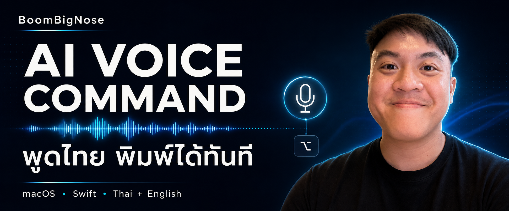

<p align="center">
  
</p>

<h1 align="center">MicTest · AI Voice Command</h1>

<p align="center">
  <strong>พูดไทย สลับอังกฤษ แล้วพิมพ์ลงแอปที่กำลังใช้</strong><br>
  แอป dictation บน Mac สำหรับคนที่คิดได้เร็วกว่าพิมพ์
</p>

<p align="center">
  
  
  
  
  <a href="https://github.com/Boom-Vitt/ai-voice-command/actions/workflows/checks.yml"></a>
</p>

<p align="center">
  <a href="#เริ่มใช้งาน">เริ่มใช้งาน</a> ·
  <a href="docs/GETTING_STARTED.md">คู่มือติดตั้ง</a> ·
  <a href="docs/PRIVACY.md">ความเป็นส่วนตัว</a> ·
  <a href="CONTRIBUTING.md">ร่วมพัฒนา</a> ·
  <a href="https://www.youtube.com/@BoomBigNose">YouTube</a>
</p>

---

MicTest เป็นแอป Swift + AppKit ที่อยู่บนแถบเมนูและมี HUD ลอยสำหรับดูสถานะ แตะ **Right Option (⌥ ขวา)** เพื่อเริ่มพูด แล้วแตะอีกครั้งเพื่อหยุด โดยไม่ต้องสลับออกจากช่องข้อความที่ทำงานอยู่

ชื่อ repository คือ **AI Voice Command** ส่วนชื่อแอปปัจจุบันคือ **MicTest** ความสามารถหลักในรุ่นนี้คือการถอดเสียงเป็นข้อความ ยังไม่มีระบบสั่งงานทั่วไปด้วยประโยคเสียง

> [!NOTE]
> **รุ่นทดลองสำหรับ build จาก source** ความแม่นยำขึ้นกับเสียง ภาษา และสภาพแวดล้อม ควรตรวจข้อความก่อนใช้งานจริง การทดสอบด้วยเสียงสังเคราะห์ไม่ใช่การรับรองความแม่นยำของเสียงคนจริง

## สิ่งที่ทำได้

| | ความสามารถ |
|:--|:--|
| 🎙️ **พูดจากแอปที่ใช้อยู่** | เริ่ม–หยุดด้วย Right Option พร้อมดูฉบับร่างและสถานะผ่าน HUD |
| 🇹🇭 **ไทย + English** | เมื่อเตรียม local runtime ครบ ใช้ Whisper large-v3 เป็นข้อความสุดท้าย และใช้ Apple Speech แสดงฉบับร่าง |
| 💻 **ประมวลผลในเครื่อง** | เส้นทาง Apple on-device + local Whisper ถอดเสียงบน Mac; Gemini เป็นทางเลือกที่ต้องเลือกเอง |
| ✍️ **พิมพ์เมื่อข้อความพร้อม** | ค่าเริ่มต้นปิด Automatic corrections รอข้อความสมบูรณ์ก่อนแทรก ช่วยลดการย้อนแก้ขณะพิมพ์ |
| 📋 **เก็บข้อความเมื่อส่งไม่ได้** | ตรวจช่องข้อความก่อนแทรก หากโฟกัสเปลี่ยนหรือแทรกไม่ได้ ใช้ **Copy last transcript** เพื่อคัดลอกเอง |
| 📖 **เพิ่มคำเฉพาะ** | ใส่ชื่อเครื่องมือ ชื่อโปรเจกต์ หรือคำศัพท์ที่ใช้บ่อยใน glossary ส่วนตัว |

## เริ่มใช้งาน

ต้องใช้ **Apple Silicon, macOS 26+ และ Swift 6 พร้อม macOS SDK ที่รองรับ macOS 26** จาก Xcode หรือ Command Line Tools โปรเจกต์ใช้ `swiftc` โดยตรง

```bash
git clone https://github.com/Boom-Vitt/ai-voice-command.git
cd ai-voice-command
./MicTest/build-dev.sh "$HOME/Applications/MicTest Dev.app"
open "$HOME/Applications/MicTest Dev.app"
```

1. อนุญาต **Microphone**, **Speech Recognition** และ **Accessibility** ตามที่แอปแจ้ง
2. วางเคอร์เซอร์ในช่องข้อความที่ต้องการพิมพ์
3. แตะ **Right Option** → พูด → แตะอีกครั้งเพื่อหยุด
4. ตรวจข้อความที่ได้ หากแทรกไม่ได้ เลือก **Copy last transcript** จากเมนู

การ build **ไม่ดาวน์โหลด Whisper หรือโมเดลให้** หากยังไม่มี runtime แอปจะใช้ Apple Speech เมื่อ on-device recognition พร้อมใช้งาน ดู [การตั้งค่า local large-v3 และการแก้ปัญหา](docs/GETTING_STARTED.md)

## เลือกวิธีถอดเสียง

| โหมด | ต้องเตรียม | การประมวลผลเสียง |
|:--|:--|:--|
| Apple Speech | สิทธิ์ macOS และ Apple on-device recognition ที่พร้อมใช้งาน | ในเครื่อง |
| Thai + English: local large-v3 | Runtime ของ MicTest, full large-v3 และ Silero VAD | ในเครื่อง; Apple แสดงฉบับร่าง แล้ว Whisper ส่งข้อความสุดท้าย |
| Gemini / Gemini Live | API key และเลือกเปิดจากเมนู | ส่งเสียงไป Google |

**Automatic corrections** เป็นตัวเลือกแยกสำหรับเปิดการแก้ข้อความที่แทรกแล้ว เปลี่ยนได้เมื่อหยุดบันทึกและงานที่ค้างเสร็จ ค่าเริ่มต้นของการติดตั้งใหม่คือปิด; ตัวเลือกที่เคยบันทึกไว้จะยังคงอยู่

อ่าน [รายละเอียดข้อมูลที่เก็บและส่งออก](docs/PRIVACY.md) ก่อนเปิด cloud mode

## รู้ไว้ก่อนลอง

- ผลลัพธ์ไทยปนอังกฤษยังอาจมีคำตก การสะกดผิด หรือวรรณยุกต์คลาดเคลื่อน
- การแทรกข้อความขึ้นกับ Accessibility ของแอปปลายทาง ไม่รองรับช่องรหัสผ่านหรือทุกช่องข้อความ
- รุ่นพัฒนาใช้ ad-hoc signing จึงอาจต้องอนุญาตสิทธิ์ใหม่หลัง rebuild
- หาก local transcription ล้มเหลว แอปอาจเก็บไฟล์เสียงไว้เพื่อกู้คืน อ่านตำแหน่งและวิธีจัดการใน [Privacy](docs/PRIVACY.md)
- การปรับโมเดลให้เข้ากับเสียงเฉพาะบุคคลยังเป็นงานออกแบบ ไม่ใช่ฟีเจอร์ที่เปิดใช้ได้

## สำหรับนักพัฒนา

```text
MicTest/
  Sources/MicTest/       แอป Swift + AppKit
  tools/                Component tests และเครื่องมือวินิจฉัย
  build-dev.sh          Build สำหรับพัฒนาโดยไม่ต้องมี Developer ID
  build.sh              Build ด้วย Developer ID ของผู้พัฒนา
thaiasr/                CLI ทดลองและเปรียบเทียบ ASR
docs/                   คู่มือและภาพประกอบ
```

ตรวจ Swift 6 typecheck และ component tests โดยไม่เปิดไมโครโฟนหรือพิมพ์ลงแอป:

```bash
bash MicTest/tools/check.sh
```

เริ่มจาก [Architecture](docs/ARCHITECTURE.md) เพื่อเข้าใจเส้นทางเสียงและข้อความ หรืออ่าน [Contributing](CONTRIBUTING.md) สำหรับแนวทางส่ง PR

## สร้างไปด้วยกัน

โปรเจกต์โดย **BoomBigNose (บูมบิ๊กโนส)** สำหรับทดลองเครื่องมือ AI ที่ใช้กับงานจริง ติดตามเบื้องหลังและไอเดียใหม่ได้ที่ [YouTube · @BoomBigNose](https://www.youtube.com/@BoomBigNose)

[แจ้งบั๊ก](https://github.com/Boom-Vitt/ai-voice-command/issues/new?template=bug_report.yml) · [เสนอไอเดีย](https://github.com/Boom-Vitt/ai-voice-command/issues/new?template=feature_request.yml) · [ดูโค้ด](MicTest/Sources/MicTest)

<details>
<summary><strong>English overview</strong></summary>

MicTest is an experimental native macOS dictation app for Thai and Thai–English speech. Tap Right Option to start or stop, follow the floating HUD, and insert completed text into the focused field. It uses on-device Apple Speech and can use a separately installed local Whisper large-v3 runtime. Optional Gemini modes send audio to Google and require explicit selection.

Build from source on Apple Silicon with macOS 26+ and Swift 6. Models are not bundled or downloaded by the app build. Real-voice accuracy and target-app compatibility remain under development.

</details>
