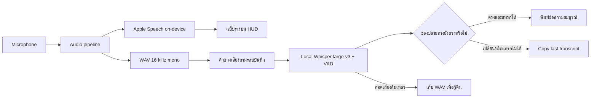

# สถาปัตยกรรม

[← กลับ README](../README.md) · [เริ่มใช้งาน](GETTING_STARTED.md) · [Privacy](PRIVACY.md)

MicTest เป็นแอป Swift 6 + AppKit แบบ `LSUIElement` ใช้เมนูบาร์และ HUD โดยไม่มีหน้าต่างหลักหรือไอคอนใน Dock สคริปต์ build คอมไพล์ `MicTest/Sources/MicTest/*.swift` ด้วย `swiftc` โดยตรง

## เส้นทางหลัก: local Thai + English

แผนภาพนี้อธิบายโหมด local large-v3 เมื่อ runtime พร้อม และปิด Automatic corrections:

เมื่อไม่มี local runtime ครบ แอปใช้ Apple Speech และ `StableTranscriptBuffer` เพื่อพักฉบับร่างจนมี final หรือหยุดบันทึก การเลือก Gemini เป็นอีกเส้นทางหนึ่งที่ผู้ใช้ต้องเปิดเอง

## ขอบเขตของแต่ละส่วน

| Source ใน `MicTest/Sources/MicTest/` | หน้าที่ |
|:--|:--|
| `main.swift` | App lifecycle, สิทธิ์, การตั้งค่า, สถานะบันทึก และประสานผลลัพธ์ |
| `HotkeyMonitor.swift`, `DictationHUD.swift` | Right Option และ HUD ที่ไม่แย่งโฟกัสจากแอปปลายทาง |
| `LiveRecognizer.swift`, `AudioReplayRing.swift` | Apple on-device recognition และเสียงช่วงเปลี่ยน recognition request |
| `AudioPipeline.swift`, `SpeechAudioGain.swift` | เตรียม PCM/WAV, แบ่งช่วงเสียง และปรับ gain ของเสียงเบาภายในขอบเขต |
| `LocalWhisperTranscriber.swift`, `LocalTranscriptionQueue.swift` | ถอดเสียง local และรักษาลำดับผลข้ามรอบ start/stop |
| `WhisperServerManager.swift` | ค้น runtime/model และดูแล lifecycle กับ ownership ของ server |
| `StableTranscriptBuffer.swift`, `TailRepair.swift` | สะสมข้อความสมบูรณ์และวางแผนแก้ท้ายข้อความโดยรักษา grapheme ไทย |
| `PendingTranscript.swift` | เก็บข้อความที่ยังส่งไม่สำเร็จและระบายตามลำดับโดยไม่ส่งซ้ำ |
| `TextInjector.swift`, `TextInjecting.swift`, `TextTargetPolicy.swift` | ตรวจ app/window/field และกิจกรรมผู้ใช้ก่อนส่งผ่าน Accessibility/clipboard |
| `CorrectionProvider.swift`, `WhisperClient.swift` | Interface และ local pass สำหรับตัวเลือกแก้ข้อความ |
| `GeminiClient.swift`, `GeminiLiveRecognizer.swift` | Cloud correction และ live recognition ที่เลือกเปิดได้ |
| `CloudKeyFile.swift`, `RefuseRedirects.swift` | โหลด config ของ cloud และกำหนดนโยบายไม่ตาม HTTP redirect |

## พฤติกรรมที่ต้องรักษา

- **ฉบับร่างกับข้อความที่พิมพ์แยกกัน:** ในโหมดปกติ draft อยู่บน HUD และแทรกเมื่อข้อความสมบูรณ์
- **ผลลัพธ์มีลำดับและปลายทาง:** คิวผูกแต่ละรอบกับช่องข้อความตอนเริ่มบันทึก การเริ่มรอบใหม่ไม่ล้างงานเก่า
- **ตรวจช่องก่อนแก้:** หากตรวจเป้าหมายไม่ได้หรือโฟกัสเปลี่ยน ให้เก็บข้อความไว้คัดลอก ไม่ส่ง blind backspace
- **พิมพ์สดใช้เป้าหมายเดียวกับผลที่มาช้า:** เก็บ token ตอนเริ่มรอบและใช้กับ partials, final และ correction; เริ่มรอบใหม่ในช่วง drain ที่เปลี่ยนปลายทางแล้วต้องเปลี่ยน generation
- **fallback มีหลักฐาน:** ช่องเดิมที่อ่าน range ไม่ได้ยังวางได้เมื่อยืนยัน selection ว่าง; ถ้าไม่มี field identity ต้องมีหน้าต่างเดิมและไม่มีการเปลี่ยนจากกิจกรรมผู้ใช้ การขาดทั้ง window และ field identity จะปฏิเสธ
- **การส่งชั่วคราวที่ล้มเหลวไม่ลบข้อความ:** เก็บ suffix ที่ยังไม่ส่งไว้ลองใหม่กับ token เดิม แยกความล้มเหลวของ ASR จากความล้มเหลวของการพิมพ์
- **รักษาอักขระไทย:** นับช่วงแก้ข้อความด้วย grapheme clusters เพื่อไม่แยกสระหรือวรรณยุกต์
- **Cloud เป็นตัวเลือกชัดเจน:** ไม่เปลี่ยนจาก local ไป Gemini อัตโนมัติเมื่อเกิดข้อผิดพลาด
- **จัดการเฉพาะ server ที่เป็นเจ้าของ:** การตอบ health check ไม่ใช่หลักฐานว่าแอปมีสิทธิ์หยุด process นั้น
- **Audio callback ทำงานให้น้อย:** แยก file I/O, UI และงานถอดเสียงออกจาก audio tap

## การทดสอบ

`bash MicTest/tools/check.sh` รัน Swift 6 typecheck และ component tests ที่ไม่ใช้ไมโครโฟน, UI, local server หรือ inference ดูรายละเอียดใน [คู่มือเครื่องมือ](../MicTest/tools/README.md)

การผ่าน tests ของ buffer, queue หรือ audio pipeline ยืนยันเฉพาะพฤติกรรมส่วนที่ทดสอบ ไม่ยืนยันความแม่นยำ ASR ด้วยเสียงคนจริง สิทธิ์ macOS หรือการแทรกข้อความในทุกแอป การทดสอบเหล่านั้นต้องระบุเครื่อง โหมด ขั้นตอน และผลสังเกตแยกกัน

`thaiasr/` เป็น CLI สำหรับทดลอง ASR แยกจากตัวแอป ส่วนการปรับโมเดลตามเสียงเฉพาะบุคคลยังอยู่ในขั้นออกแบบ
